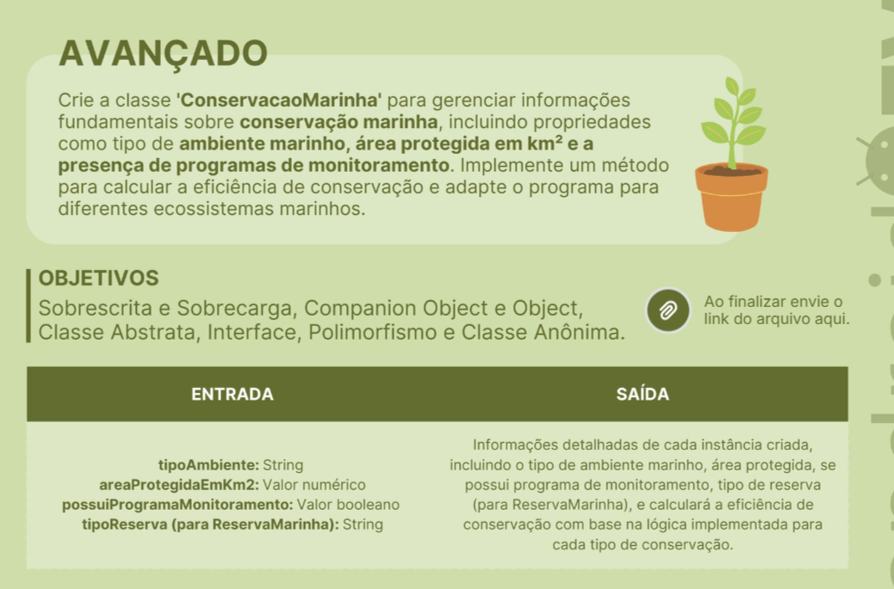

# Conservação Marinha

Crie a classe `ConservacaoMarinha` para gerenciar informações fundamentais sobre conservação marinha, incluindo propriedades como tipo de ambiente marinho, área protegida em km² e a presença de programas de monitoramento. Implemente um método para calcular a eficiência de conservação e adapte o programa para diferentes ecossistemas marinhos.

## Objetivos

- Sobrescrita e Sobrecarga
- Companion Object e Object
- Classe Abstrata, Interface, Polimorfismo e Classe Anônima

## Entrada

- `tipoAmbiente`: String
- `areaProtegidaEmKm2`: Valor numérico
- `possuiProgramaMonitoramento`: Valor booleano
- `tipoReserva` (para `ReservaMarinha`): String

## Saída

Informações detalhadas de cada instância criada, incluindo
o tipo de ambiente marinho, área protegida, se possui programa
de monitoramento, tipo de reserva (para `ReservaMarinha`), e
cálculo da eficiência de conservação com base na lógica implementada
para cada tipo de conservação.

